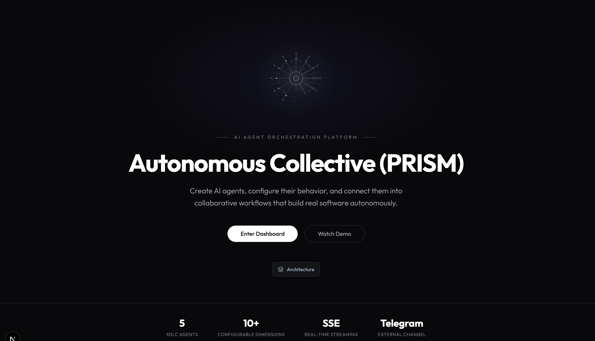
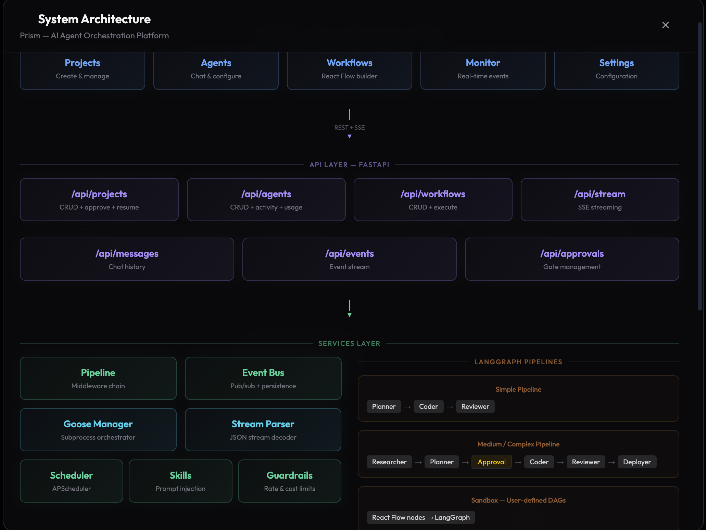
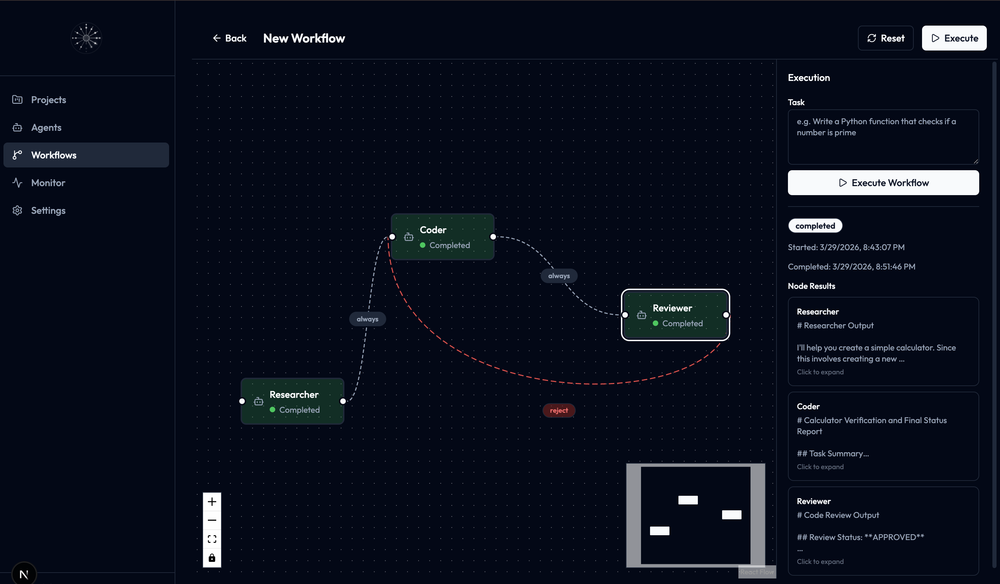
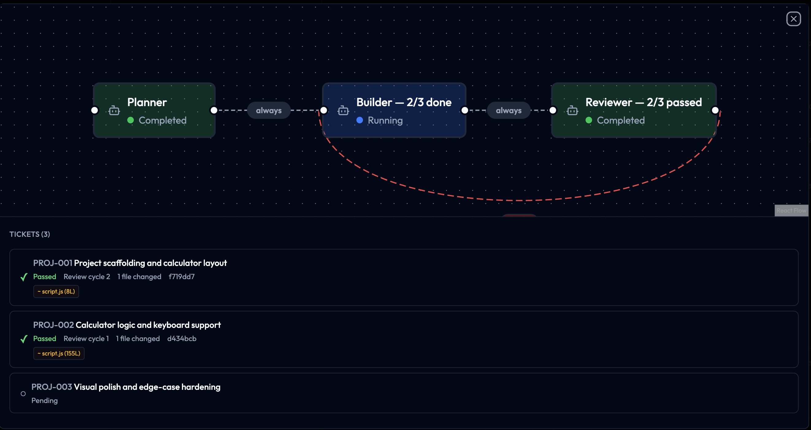

# Prism

AI Agent Orchestration Platform — give it a brief, get back a working app, watch every step happen live.

## Demo

> **[Watch the demo video](https://www.loom.com/share/e315388b5e67478eab69fbe47a20ad97)** — end-to-end project creation, live agent monitoring, and workflow execution.

## Screenshots

### Landing Page


### System Architecture


### Visual Workflow Builder


### Live Pipeline Execution


## What It Does

**Project Mode:** Provide a project brief → Prism auto-creates specialized SDLC agents → they research, plan, code, review, and deploy your app. Human-in-the-loop approval gates. Live streaming of every tool call.

**Sandbox Mode:** Create custom agents with comprehensive system prompts. Wire them into any DAG topology with conditional edges using a visual workflow builder. Chat directly. Telegram integration. Cron scheduling.

## Architecture

```
┌──────────────────────────────────────────────────────────────┐
│  Frontend (:3000)                                             │
│  Next.js 16 + shadcn/ui + React Flow + Zustand               │
│  Pages: Projects, Agents, Workflows, Monitor, Settings        │
└──────┬────────────────────────────────────┬───────────────────┘
       │ REST (proxied)                     │ SSE (direct)
┌──────▼────────────────────────────────────▼───────────────────┐
│  API Layer (:8000) — FastAPI                                   │
│  /api/projects  /api/agents  /api/workflows  /api/stream       │
│  /api/messages  /api/events  /api/approvals                    │
├───────────────────────────────────────────────────────────────┤
│  Services Layer                                                │
│  Pipeline (middleware chain)  ·  Event Bus (pub/sub + persist)  │
│  Goose Manager (subprocess)  ·  Stream Parser (JSON decoder)   │
│  Scheduler (APScheduler)     ·  Skills (prompt injection)      │
│  Guardrails (rate + cost)    ·  Telegram Bot                   │
├───────────────────────────────────────────────────────────────┤
│  LangGraph Pipelines                                           │
│  Simple:  Planner → Coder → Reviewer                           │
│  Medium:  Researcher → Planner → Approval → Coder → Reviewer → Deployer │
│  Sandbox: React Flow nodes → LangGraph (any DAG)               │
├───────────────────────────────────────────────────────────────┤
│  Execution                                                     │
│  Goose CLI (subprocess per agent) · Claude Code / Opus 4       │
│  Tools: developer, analyze, custom extensions                  │
├───────────────────────────────────────────────────────────────┤
│  Data & Integrations                                           │
│  SQLite (SQLAlchemy) · Agents, Projects, Messages, Events,     │
│  Workflows, Skills tables · Telegram Bot · LangGraph Checkpointer │
└───────────────────────────────────────────────────────────────┘
```

## Quick Start

**One command:**

```bash
./start.sh
```

This installs all dependencies (Python venv + pnpm), starts both servers, and opens the app at http://localhost:3000. Press Ctrl+C to stop.

**Manual setup (if you prefer):**

```bash
# Backend
cd backend
python3 -m venv ../.venv
source ../.venv/bin/activate
pip install -e ".[dev]"
uvicorn server:app --reload --port 8000

# Frontend (new terminal)
cd frontend
pnpm install
pnpm dev
```

**Environment variables (optional):**

```bash
export TELEGRAM_BOT_TOKEN=your_token   # Enable Telegram integration
export ANTHROPIC_API_KEY=your_key      # Required for agent execution
```

**CLI shortcuts:**

```bash
./cli.sh demo           # Seed demo agents
./cli.sh health         # Check server
./cli.sh new "Snake" "Make me a snake game" /tmp/snake
```

**Run tests:**

```bash
cd backend && python3 -m pytest tests/ -v
```

## Tech Stack

| Layer | Choice |
|-------|--------|
| Frontend | Next.js 16, shadcn/ui, React Flow, Zustand |
| Backend | Python, FastAPI, LangGraph |
| Agent Runtime | Goose CLI (claude-code provider) |
| Database | SQLite via SQLAlchemy |
| Real-time | Server-Sent Events (SSE) |
| Comms | Telegram Bot |
| Intelligence | Skill injection (role-specific .md files) |

### Why Goose?

We evaluated all three runtimes:

- **OpenClaw** — Markdown-defined agents (SOUL.md) with built-in scheduling and memory. Good for personal agents but too opinionated for a multi-agent orchestration platform. No programmatic API for dynamic agent creation.
- **OpenCode** — Terminal-native coding agent. Fast and lightweight but designed for single-user CLI usage. No built-in multi-agent coordination or tool extension system.
- **Goose** — Open-source agent by Block with extension-based tool system, provider-agnostic model support, and structured JSON streaming output. Spawns as a subprocess with `--output-format stream-json`, making it easy to capture tool calls, text output, and errors in real-time.

Goose was chosen because:
1. **Provider-agnostic** — switch between Claude, GPT, or local models via `--provider` and `--model` flags
2. **Structured streaming** — `stream-json` output gives us typed chunks (text, toolRequest, toolResponse) that map directly to our UI
3. **Subprocess isolation** — each agent runs in its own process with its own working directory, preventing state leakage between agents
4. **Extension system** — built-in tools (developer, analyze) plus custom extensions, configurable per agent

## How It Works

### Project Mode

1. User provides brief + target directory
2. Complexity assessed (simple/medium/complex)
3. LangGraph pipeline executes:
   - **Simple:** Planner → Coder → Reviewer → Done
   - **Medium:** Researcher → Planner → Approval Gate → Coder(s) → Reviewer → Deployer
   - **Complex:** Multi-phase variant with parallel coders
4. Each agent is a Goose subprocess with a role-specific prompt loaded from `.md` files
5. Agents communicate via `.workflow/{node_id}.md` handoff files
6. `.factory/state.json` checkpoints every phase — resume from any point after failure
7. Every tool call streams to the Monitor dashboard in real-time

### Sandbox Mode

1. Create agents with custom system prompts, models, tools, and channels
2. Wire them into any DAG using the React Flow workflow builder
3. Add conditional edges (`if output contains ERROR → retry`)
4. Execute workflows — sandbox engine auto-detects brownfield vs. greenfield projects
5. Nodes hand off via `.workflow/{node_id}.md` files
6. Chat with agents directly or via Telegram

### Key Capabilities

- **Parallel ticket execution** — independent tickets coded simultaneously via `asyncio.gather`
- **Feedback loops** — Reviewer sends structured issues back to Coder (up to 3 cycles)
- **Approval gates** — human-in-the-loop at the architecture phase
- **Skill injection** — role-specific .md knowledge files, update without code changes
- **Full audit trail** — every event persisted to SQLite, reconstruct any project from its log
- **Telegram integration** — orchestrate entire projects from your phone (`/run DevPipeline | build a snake game`)
- **State checkpointing** — resume from any phase after failure

## Project Structure

```
prism/
├── backend/
│   ├── server.py           # FastAPI app + lifespan
│   ├── db/                 # SQLAlchemy models + database
│   ├── routes/             # API endpoints (agents, projects, workflows, streaming, events)
│   ├── services/           # Pipeline, Event Bus, Goose Manager, Telegram Bot, Scheduler
│   ├── graphs/             # LangGraph definitions (simple, medium, complex, sandbox)
│   ├── prompts/            # Role prompts as .md files (seeded into DB, editable in UI)
│   ├── contracts/          # Pydantic schemas + state.json
│   ├── skills/             # Reusable skill .md files (research, planning, tdd, code-review)
│   └── tests/              # pytest integration tests
├── frontend/
│   ├── src/app/            # Next.js pages (landing, dashboard)
│   ├── src/components/     # React components (workflow builder, agent form, monitor)
│   └── src/lib/            # Zustand stores + utils
├── start.sh                # One-command startup
├── stop.sh                 # Stop all servers
├── cli.sh                  # Terminal interface
└── README.md
```

## Extending Prism

### Adding a New Agent Role

1. Write a system prompt in `backend/prompts/{role}.md`
2. Restart the server — `demo_setup` seeds the prompt into the DB
3. The agent is now available in the workflow builder and can be assigned to any node
4. Prompts are editable in the UI — the `.md` file is the default, UI edits override it

### Adding a New Workflow Template

1. Add an entry to `WORKFLOW_TEMPLATES` in `backend/services/demo_setup.py` with nodes (React Flow format) and edges
2. Restart the backend — `setup_demo()` upserts templates by name
3. Template appears on the Workflows page and is selectable during project creation

### Adding a New Messaging Channel

1. **Create the adapter** — add `backend/services/discord_bot.py` following the `telegram_bot.py` pattern
2. **Store messages** — set `channel="discord"` when saving to the messages table
3. **Register in server lifespan** — add startup/shutdown calls in `backend/server.py`, gated on an env var
4. **Add UI toggle** — add a checkbox in `frontend/src/components/agent-form.tsx`
5. **Wire up routing** — the agent's `channels` JSON array controls which channels it responds on

### Adding a New Skill

1. Drop a `.md` file in `backend/skills/`
2. Map it to roles in `ROLE_SKILLS` in `backend/graphs/nodes.py` — it gets injected into prompts automatically

### Adding New Guardrails

1. Add logic to `backend/services/guardrails.py`
2. Configure per-agent via the UI settings

## Agent Configuration Dimensions

Each agent is configurable across these dimensions (all via UI):

| Dimension | Description |
|-----------|-------------|
| **System Prompt** | Role instructions, seeded from `.md` files, fully editable |
| **Model** | claude-opus, claude-sonnet, claude-haiku, or any Goose-supported model |
| **Provider** | claude-code, anthropic, openai, ollama, etc. |
| **Tools** | Goose builtins: developer, analyze, apps, todo, summarize |
| **Skills** | Reusable `.md` knowledge injected into prompts (research, tdd, code-review) |
| **Schedule** | Cron expressions for recurring tasks |
| **Memory** | Persistent key-value facts retained across sessions |
| **Channels** | Telegram (extensible to Slack, Discord) |
| **Guardrails** | Rate limits, cost limits, blocked actions |
| **Interaction Rules** | What the agent can do autonomously vs. what requires approval |
| **MCP Extensions** | External tool servers (e.g., Unity Editor via Coplay MCP) |
